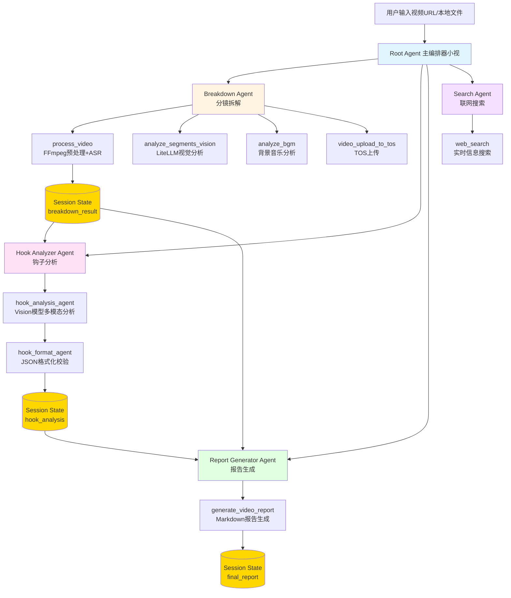

# 技术架构图生成指南

由于系统限制，架构图需要您手动完成生成。请按照以下步骤操作：

## 方式一：使用 Mermaid Live Editor（推荐）

### 步骤 1：访问在线编辑器

打开浏览器访问：https://mermaid.live/

### 步骤 2：复制 Mermaid 代码

打开项目中的 `img/README.md` 文件，复制"Multi-Agent 架构流程图"部分的 Mermaid 代码（从 ` ```mermaid` 到 ` ``` ` 之间的所有内容）。

或者直接复制以下代码：



### 步骤 3：粘贴到编辑器

将复制的代码粘贴到 Mermaid Live Editor 的左侧编辑区。右侧会自动渲染出架构图。

### 步骤 4：导出图片

1. 点击右上角的 "Actions" 菜单
2. 选择 "Export as PNG" 或 "Export as SVG"
3. 建议导出分辨率：1920x1080 或更高
4. 将导出的图片重命名为 `architecture_video_breakdown_agent.jpg`
5. 保存到项目的 `img/` 目录下

### 步骤 5：更新 README 引用

将 `README.md` 和 `README_en.md` 中的以下行：

```markdown

```

修改为：

```markdown

```

---

## 方式二：使用 VS Code 插件

### 步骤 1：安装插件

在 VS Code 中安装插件：`Markdown Preview Mermaid Support`

### 步骤 2：查看图表

1. 打开 `img/README.md` 文件
2. 使用 VS Code 的 Markdown 预览功能（Cmd/Ctrl + Shift + V）
3. 架构图会自动渲染

### 步骤 3：截图保存

1. 对渲染的架构图进行截图
2. 保存为 `img/architecture_video_breakdown_agent.jpg`

---

## 方式三：使用命令行工具（需要 Node.js）

### 步骤 1：安装 Mermaid CLI

```bash
npm install -g @mermaid-js/mermaid-cli
```

### 步骤 2：准备 Mermaid 文件

将上述 Mermaid 代码保存为 `architecture.mmd` 文件（去掉 ` ```mermaid` 和 ` ``` ` 标记）。

### 步骤 3：生成图片

```bash
cd /Users/edy/Downloads/agentkit-samples-main/02-use-cases/video_breakdown_agent

# 生成 PNG（推荐）
mmdc -i img/architecture.mmd -o img/architecture_video_breakdown_agent.png -w 1920 -H 1080

# 或生成 JPG
mmdc -i img/architecture.mmd -o img/architecture_video_breakdown_agent.jpg -w 1920 -H 1080
```

---

## 完成后验证

确认以下文件已存在：

```bash
ls -lh img/architecture_video_breakdown_agent.jpg
```

如果文件存在且大小合理（通常 > 50KB），说明生成成功！

---

## 推荐参数

- **分辨率**: 1920x1080 或 2560x1440
- **格式**: JPG 或 PNG（JPG 文件更小）
- **质量**: 中等到高（避免压缩过度导致文字模糊）

---

## 备注

如果您暂时无法生成架构图，可以：

1. 暂时保留 Mermaid 代码在 README 中（GitHub 和大多数 Markdown 工具支持渲染）
2. 后续补充架构图文件
3. 架构图虽然是"可选"项，但强烈建议补充，可以显著提升项目在应用广场的展示效果

---

**当您完成架构图生成后，请告知我，我将继续执行后续步骤（验证文件完整性并提交到 Codeup 仓库）。**
